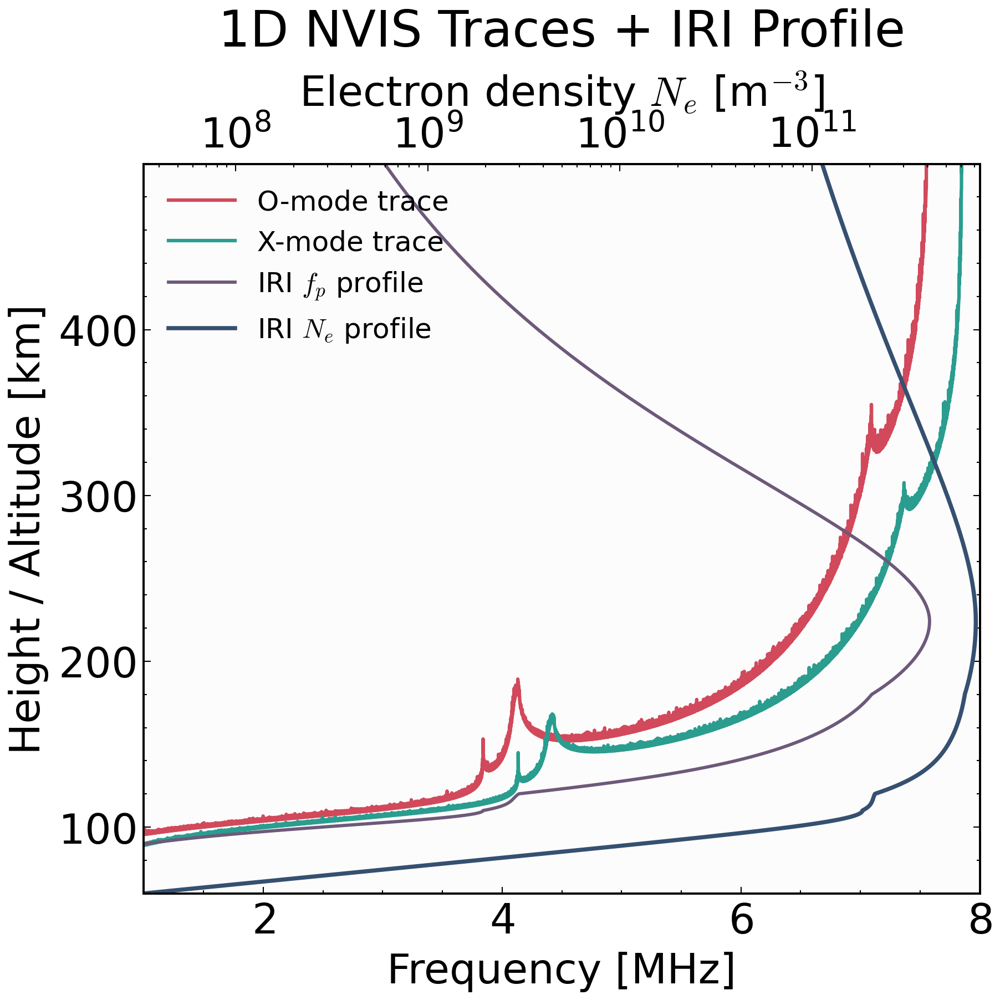
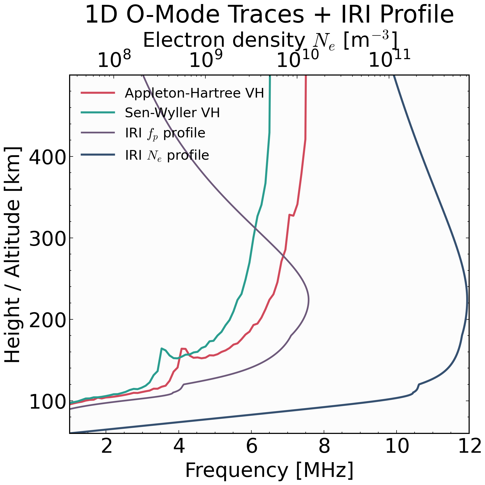
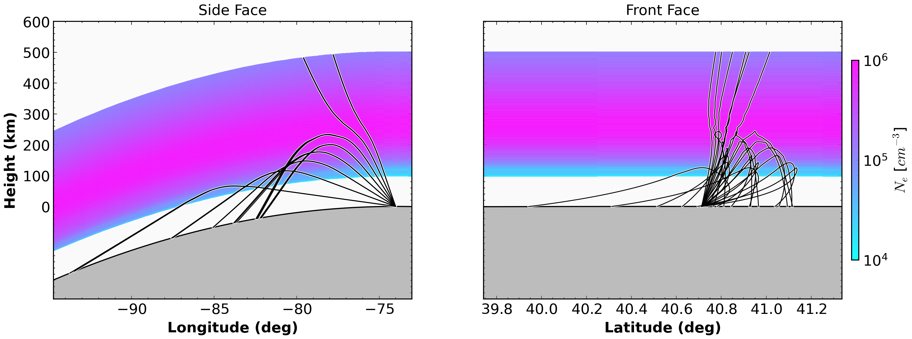
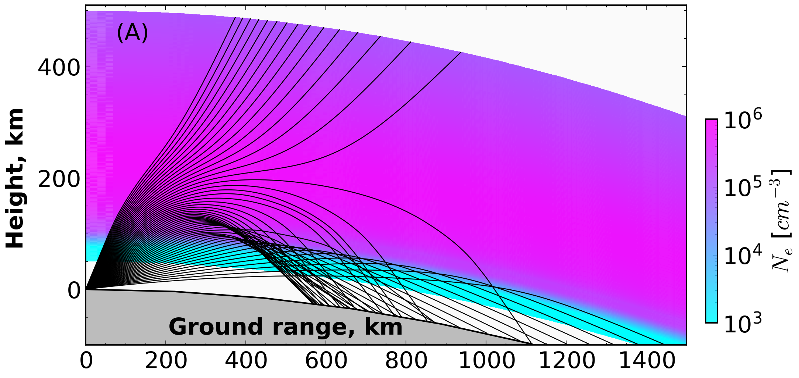
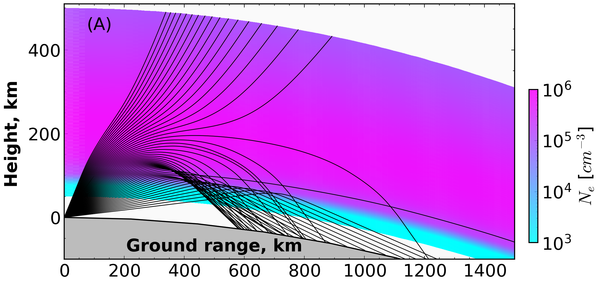

# Examples

  <h3>Executable Workflows</h3>
  
Hands-on examples for model setup, PHaRLAP execution, and result visualization.

  

    <strong>RT1D NVIS O/X (IRI)</strong>
    Single-panel 1D tracer plot with O/X virtual height traces, IRI plasma-frequency profile, and top-axis IRI electron density.
     <a href="rtmodel_nvis_ox_iri_1d/">Open Example</a>
  

  

    <strong>RT1D O-Mode Appleton vs Sen-Wyller</strong>
    Formulation comparison using a common 1D IRI profile and shared tracer axis conventions.
     <a href="rtmodel_omode_appleton_sw_demo/">Open Example</a>
  

  

    <strong>PHaRLAP + IRI 2D Ray Trace</strong>
    End-to-end workflow: route setup, IRI density grid, collision model, PHaRLAP 2D run, and plotting.
     <a href="pharlap_iri/">Open Example</a>
  

  

    <strong>PHaRLAP + IRI 3D Ray Trace</strong>
    End-to-end workflow: 3D IRI/collision grids, PHaRLAP 3D run, and side/front face plots.
     <a href="pharlap_iri_3d/">Open Example</a>
  

  

    <strong>RT2D IRI Cartesian Ray Trace</strong>
    Pure-Python 2D Cartesian oblique tracing with IRI route profiles and density-ray overlay plots.
     <a href="rt2d_iri_cartesian/">Open Example</a>
  

  

    <strong>RT2D IRI Spherical Ray Trace</strong>
    Pure-Python 2D spherical oblique tracing with Earth-radius geometry and density-ray overlays.
     <a href="rt2d_iri_spherical/">Open Example</a>
  

!!! warning "3D Geoplot3 Status"
    MATLAB `geoplot3` support is temporarily disabled in the 3D example script.

## Figure Gallery

