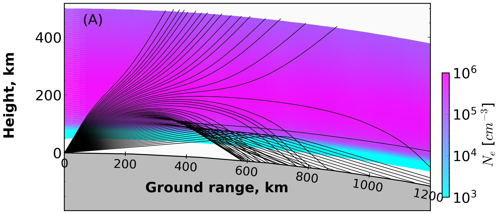

# PHaRLAP + IRI 2D and 3D Ray Trace

!!! warning "3D Geoplot3 Status"
    The MATLAB `geoplot3` output path is **WIP** and environment dependent.
    It requires Mapping Toolbox and display functionality. In headless mode, TRACE falls back to MATLAB `plot3` ECEF rendering.

<div class="hero">
  <h3>End-to-End Example: Density Model to Ray Path Plot</h3>
  <p>Uses IRI + NRLMSISE background inputs, runs PHaRLAP, and visualizes ray trajectories over <code>ne_grid</code>.</p>
</div>

This page explains the example script:

- `examples/run_pharlap_iri.py`

It is an end-to-end wrapper that prepares ionosphere/background inputs, runs PHaRLAP through MATLAB Engine, and plots ray paths over the IRI electron density field.

## PyIRI Backend Config

TRACE now uses `PyIRI` for IRI density fetch (`PyIRI.sh_library.IRI_density_1day`).
Use `iri_param` in `trace/cfg/config2D.json`:

```json
"iri_param": {
  "f107": 150.0,
  "foF2_coeff": "CCIR",
  "hmF2_model": "SHU2015",
  "coord": "GEO"
}
```

`iri_version` is deprecated and ignored by the current backend.

## Call Flow

1. `main()` parses CLI args (`--config`, `--event`, `--no-matlab`) and loads config.
2. `_run(...)` prepares all model inputs:
   - route and bearing (`build_route_from_cfg`)
   - height grid (`build_heights_from_cfg`)
   - elevation fan (`build_elevations_from_cfg`)
   - frequencies (`build_freqs_from_cfg`)
3. IRI density is fetched via `IRI2d.fetch_dataset(...)` into `ne_grid` (2D) and can be extended for 3D grids.
4. Collision frequency is computed from:
   - NRLMSISE-00 neutral background (`ComputeCollision.from_nrlmsise`)
   - simple plasma defaults (`Te`, `Ti`, `Op`, `O2p`) derived in script
5. PHaRLAP is run via `Engine.run_pharlap(...)`.
6. `_plot_ray_paths(...)` overlays `ray_path_data[i].ground_range` vs `ray_path_data[i].height` on `ne_grid` using `PlotRays`.

## Key Code (From `run_pharlap_iri.py`)

### 1) Grid Construction and IRI Fetch

```python
n_range = int(cfg.number_of_ground_step_km)
lats, lons, rb, route_km = build_route_from_cfg(cfg, n_range)
heights = build_heights_from_cfg(cfg)
iri = IRI2d(cfg, event_time)
ne_grid, _ = iri.fetch_dataset(event_time, lats, lons, heights)

elevs = build_elevations_from_cfg(cfg)
freqs = build_freqs_from_cfg(cfg, elevs)
range_inc = float(route_km) / max(ne_grid.shape[1] - 1, 1)
height_inc = float(getattr(cfg, "height_incriment_km", 1.0))
```

### 2) Collision Frequency (NRLMSISE-Driven)

```python
te_grid = np.full_like(ne_grid, 1000.0, dtype=float)
ti_grid = np.full_like(ne_grid, 1000.0, dtype=float)
op_grid = 0.9 * ne_grid
o2p_grid = 0.1 * ne_grid

cc = ComputeCollision.from_nrlmsise(
    date=event_time,
    lats=lats,
    lons=lons,
    heights_km=heights,
    Te=te_grid,
    Ti=ti_grid,
    edens=ne_grid,
    O2p=o2p_grid,
    Op=op_grid,
    update_spaceweather=False,
    suppress_spaceweather_warning=True,
)
collision_freq = cc.collision.nu_ft
```

### 3) PHaRLAP Call

```python
engine = Engine()
try:
    ray_data, ray_path_data = engine.run_pharlap(
        ne_grid=ne_grid,
        collision_freq=collision_freq,
        elevs=elevs,
        rb=rb,
        freqs=freqs,
        irreg=irreg,
        nhops=int(cfg.nhops),
        tol=float(getattr(cfg, "threshold", 1e-7)),
        radius_earth=float(cfg.radius_earth),
        irregs_flag=0,
        start_height=int(round(float(cfg.start_height_km))),
        height_inc=int(round(height_inc)),
        range_inc=int(round(range_inc)),
    )
finally:
    engine.close()
```

### 4) Plotting `ray_path_data` Over `ne_grid`

```python
X, Z = np.meshgrid(np.linspace(0.0, route_km, ne_grid.shape[1]), heights)
rays = []
for r in ray_path_data:
    rays.append(
        SimpleNamespace(
            x_km=np.asarray(r.ground_range, dtype=float),
            y_km=np.asarray(r.height, dtype=float),
            el0_deg=float(r.initial_elev),
        )
    )

rp = PlotRays(oth=False, xlim=[0.0, float(route_km)], ylim=[float(heights[0]), float(heights[-1])])
rp.set_density(X, Z, ne_grid, pf=None)
rp.lay_rays(outputs=rays, kind="edens", lcolor="k", lw=0.6, param_alpha=0.85)
rp.save("pharlap_iri_ray_paths.png")
rp.close()
```

## Run

From repository root:

```bash
cd /home/chakras4/Research/CodeBase/trace
python examples/run_pharlap_iri.py
```

To validate setup only (skip MATLAB execution):

```bash
python examples/run_pharlap_iri.py --no-matlab
```

## Output Figure

Saved figure:

- `pharlap_iri_ray_paths.png`

Rendered example image:



## Related Files

- `examples/run_pharlap_iri.py`
- `examples/run_pharlap_iri_3d.py` (3D companion)
- `trace/pharlap.py`
- `trace/collision.py`
- `trace/plottrace.py`

## See Also

- [PHaRLAP + IRI 3D Ray Trace](pharlap_iri_3d.md)
