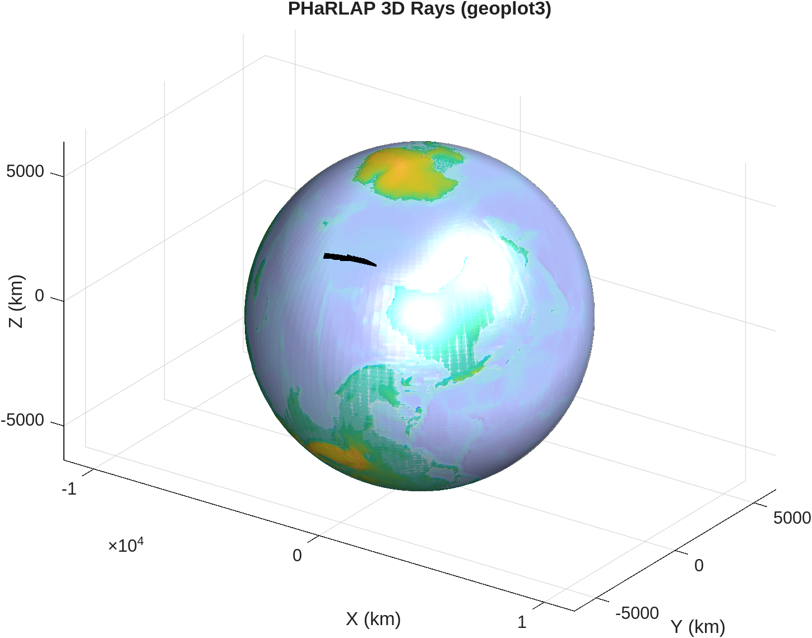
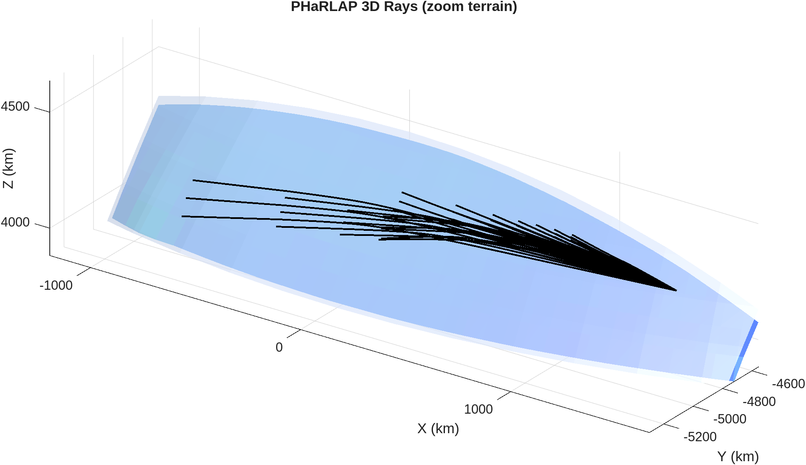

# PHaRLAP + IRI 3D Ray Trace

!!! warning "3D Geoplot3 Status (WIP)"
    MATLAB `geoplot3` rendering is currently **WIP** and environment dependent.
    Full globe rendering requires Mapping Toolbox and display-enabled MATLAB.
    In headless sessions, TRACE falls back to MATLAB `plot3` ECEF rendering.

<div class="hero">
  <h3>End-to-End 3D Workflow</h3>
  <p>Build 3D IRI density + 3D collision grids, run PHaRLAP 3D, and generate side/front and globe-style ray visualizations.</p>
</div>

This page documents:

- `examples/run_pharlap_iri_3d.py`

## Call Flow

1. Load `trace/config3D.json`.
2. Build 3D model grids:
   - IRI electron density via `IRI3d.fetch_dataset(...)` -> `(lat, lon, height)`
   - collision frequency via `ComputeCollision.from_nrlmsise_3d(...)`
3. Build ray fan from elevation and bearing ranges.
4. Run PHaRLAP 3D:
   - `Engine.run_pharlap_3d_sp(...)` when `use_spherical=true`
   - otherwise `Engine.run_pharlap_3d(...)`
5. Plot outputs:
   - Python 2-panel arc-style face plot (`PlotRays3D`)
   - MATLAB globe/headless 3D plot (`MatlabGeoPlot3D`)

## Run

From repository root:

```bash
cd /home/chakras4/Research/CodeBase/trace
python examples/run_pharlap_iri_3d.py --config trace/config3D.json
```

Build-only (skip MATLAB raytrace):

```bash
python examples/run_pharlap_iri_3d.py --config trace/config3D.json --no-matlab
```

## Main Outputs

- `docs/examples/figures/pharlap_iri_3d_ray_faces.png`
- `docs/examples/figures/pharlap_iri_3d_geoplot3.png`
- `docs/examples/figures/pharlap_iri_3d_geoplot3_zoom_terrain.png`

## Rendered Figures

### Side/Front Faces (Python)


### Globe/Headless MATLAB 3D


### Zoom Terrain View


## Related Files

- `examples/run_pharlap_iri_3d.py`
- `trace/pharlap.py`
- `trace/collision.py`
- `trace/density/iri.py`
- `trace/plottrace.py`
