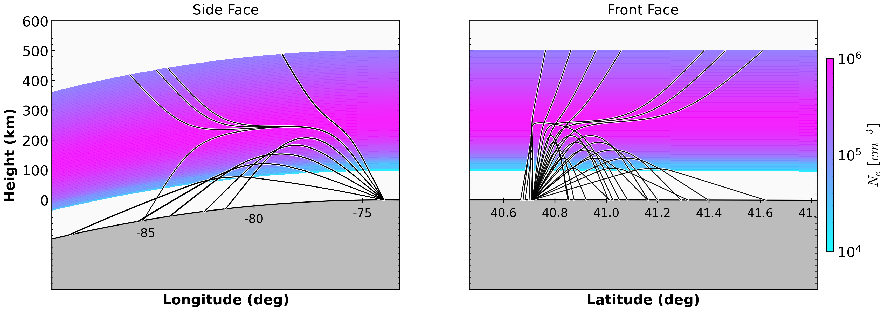
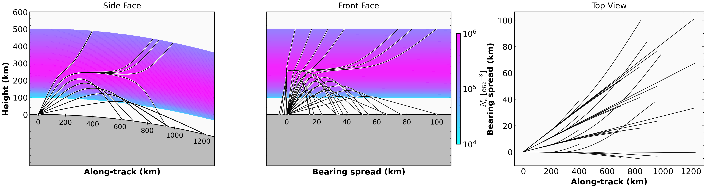

# RT3D IRI Cartesian Ray Trace

<div class="hero">
  <h3>Pure-Python 3D RT Workflow</h3>
  <p>
    Build a 3D IRI profile on a `(lat, lon, alt)` grid, run RT3D oblique fan tracing,
    and generate side/front plus route-aligned 3D face plots.
  </p>
</div>

This page explains:

- `examples/run_rt3d_iri_cartesian.py`

## Call Flow

1. `main()` parses `--config` and `--event`.
2. `_run(...)` loads a 3D profile:
   - `RT3DProfile.from_cfg(..., fetch_iri=True, fetch_geomag=...)`
3. Tracing grid is extended to ground (default):
   - `extend_to_ground=true` adds `0..z_floor` with zero density.
4. Optional collision volume is built:
   - `ComputeCollision.from_nrlmsise_3d(...)`
   - on failure, zeros are used.
5. `RT3D(profile=...)` initializes solver state.
6. `_trace_fan(...)` runs all rays via:
   - `RT3D.oblique_trace(...)`
7. If Hamiltonian fails for most rays, script retries with gradient solver.
8. Figures are created:
   - `_plot_ray_faces(...)` -> side/front in lat/lon views
   - `_plot_route_faces(...)` -> 3-panel route view:
     along-track, bearing-spread, and top view

## Solver Notes

- `config3D.json` controls default coordinate/solver:
  - `use_spherical` -> spherical or cartesian tracing
  - `solver` -> `"hamiltonian"` or `"gradient"`
- The script includes robust fallback from Hamiltonian to gradient when failure
  ratio is high, to keep example outputs usable.

## Key Code

### 1) Build RT3D Profile

```python
rt_profile = RT3DProfile.from_cfg(
    cfg=cfg,
    time=event_time,
    fetch_iri=True,
    fetch_msise=False,
    fetch_geomag=fetch_geomag,
    workers=workers,
)
```

### 2) Run 3D Fan Traces

```python
out = rt.oblique_trace(
    freq_hz=float(f_mhz) * 1e6,
    elevation_deg=float(el),
    azimuth_deg=float(az),
    coordinate_system=str(coordinate_system),
    solver=str(solver),
    x0_km=float(x0_km),
    y0_km=float(y0_km),
    z0_km=float(z0_km),
    mode="O",
    formulation="appleton-hartree",
    collision_hz=collision_hz,
    b_abs_t=b_abs_t,
    b_psi_deg=b_psi_deg,
    max_step_km=2.0,
)
```

### 3) Plot Faces

```python
_plot_ray_faces(
    ne_grid=ne_plot,
    ray_path_data=ray_paths,
    lats=rt_profile.lats,
    lons=rt_profile.lons,
    heights=heights_plot,
    origin_lat=origin_lat,
    origin_lon=origin_lon,
    out_file=out_file,
)
```

and

```python
_plot_route_faces(
    ne_grid=ne_plot,
    ray_path_data=ray_paths,
    lats=rt_profile.lats,
    lons=rt_profile.lons,
    heights=heights_plot,
    origin_lat=origin_lat,
    origin_lon=origin_lon,
    bearing_deg=bearing_ref,
    out_file=out_file_route,
)
```

The route-aligned panel uses `PlotRays3DRouteFaces` and now renders:

1. along-track vs height
2. bearing-spread vs height
3. top view (`along-track` vs `bearing-spread`)

By default, the colorbar is anchored after panel 2 and the spacing between
panel 2 and panel 3 is widened for readability.

## Run

```bash
cd /home/chakras4/Research/CodeBase/trace
python examples/run_rt3d_iri_cartesian.py
```

Custom run:

```bash
python examples/run_rt3d_iri_cartesian.py \
  --config hfpytrace/cfg/config3D.json \
  --event 2017-05-27T16:00:00Z
```

## Output Figures





## Related Files

- `examples/run_rt3d_iri_cartesian.py`
- `hfpytrace/model/rt3d.py`
- `hfpytrace/density/iri.py`
- `hfpytrace/collision.py`
- `hfpytrace/plottrace.py`
