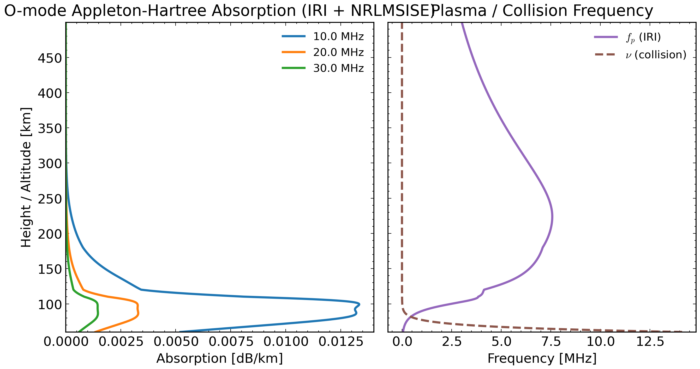

# RT1D O-Mode Appleton Absorption (IRI)

<div class="hero">
  <h3>1D O-Mode Absorption Curves in dB/km</h3>
  <p>
    Uses a 1D IRI profile with NRLMSISE-driven collision frequency and computes
    Appleton-Hartree O-mode absorption for three frequencies (default includes 30 MHz).
  </p>
</div>

This page explains:

- `examples/rtmodel_omode_absorption_appleton_iri_1d.py`

## Call Flow

1. Load `config1D.json` via `load_config_1D(...)`.
2. Build profile:
   - `RT1DProfile.from_cfg(..., fetch_iri=True, fetch_msise=True, fetch_geomag=True)`
3. Build collision profile from NRLMSISE neutrals through:
   - `ComputeCollision.from_nrlmsise(...)`
4. For each requested frequency, evaluate:
   - `AppletonHartreeDispersion(...).evaluate(mode="O")`
5. Plot a two-panel figure:
   - left: absorption vs altitude in `dB/km`
   - right: plasma frequency (`f_p`) and collision frequency (`nu`) in `MHz`

## Key Code

### 1) Build 1D Profile

```python
profile = RT1DProfile.from_cfg(
    cfg=cfg,
    time=event_time,
    fetch_iri=True,
    fetch_msise=True,
    fetch_geomag=True,
)
```

### 2) Build Collision and Evaluate Appleton O-Mode

```python
cc = ComputeCollision.from_nrlmsise(
    date=event_time,
    alts_km=profile.alts_km,
    Te=profile.Te,
    Ti=profile.Ti,
    edens=profile.ne_cm3,
    O2p=profile.O2p,
    Op=profile.Op,
)

disp = AppletonHartreeDispersion(
    frequency_hz=freq_hz,
    ne_m3=profile.ne_m3,
    collision_hz=cc.collision.nu_ft,
    b_t=profile.b_abs_t,
    theta_deg=profile.b_psi_deg,
)
res = disp.evaluate(mode="O")
```

### 3) Plot Construction

```python
# left panel: absorption(dB/km) vs altitude
# right panel: fp(MHz) and nu(MHz) diagnostics
fig.savefig(out_file, dpi=300, bbox_inches="tight")
```

## Run

```bash
cd /home/chakras4/Research/CodeBase/trace
python examples/rtmodel_omode_absorption_appleton_iri_1d.py
```

Custom frequencies (must be 3 values):

```bash
python examples/rtmodel_omode_absorption_appleton_iri_1d.py --freqs 15,22,30
```

Disable automatic collision-frequency safety rescale:

```bash
python examples/rtmodel_omode_absorption_appleton_iri_1d.py --no-auto-nu-rescale
```

## Output Figure

Default output:

- `docs/examples/figures/rt1d_omode_absorption_appleton_iri.png`



## Related Files

- `examples/rtmodel_omode_absorption_appleton_iri_1d.py`
- `trace/model/rt1d.py`
- `trace/model/dispersion.py`
- `trace/collision.py`
- `trace/plottrace.py`

## See Also

- [RT1D NVIS O/X from IRI](rtmodel_nvis_ox_iri_1d.md)
- [RT1D O-Mode Appleton vs Sen-Wyller](rtmodel_omode_appleton_sw_demo.md)
